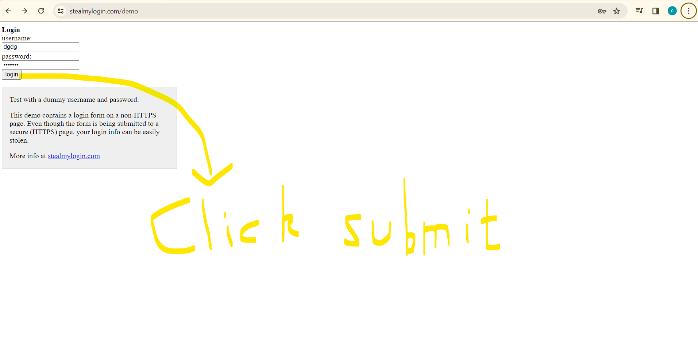
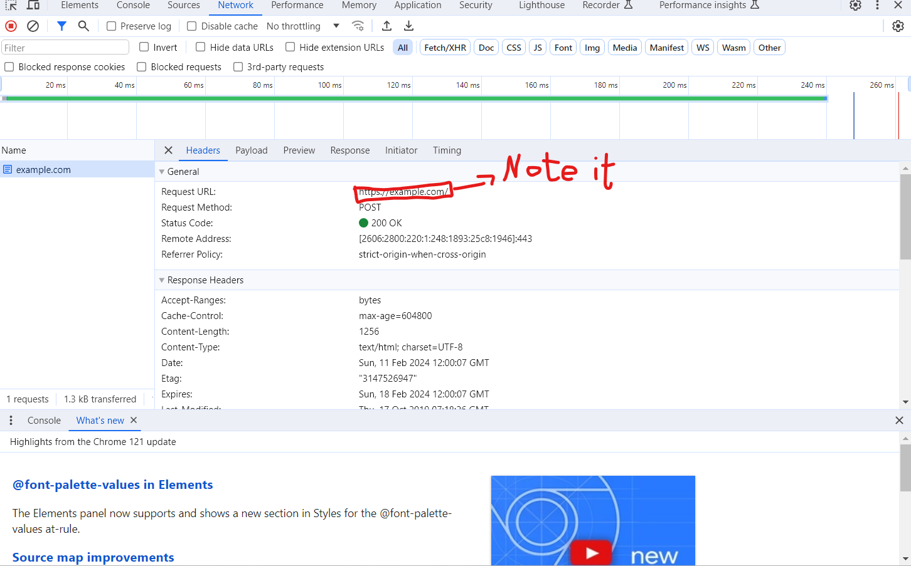
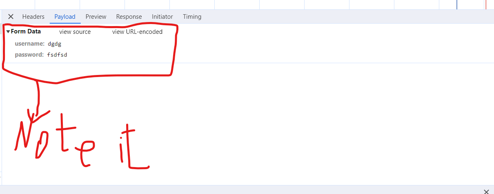

1. Click submit on the sign up form or any kind of form that sends POST REQUESTS

2. Take note of request url, dont assume the request url to be the same as the url on the top of the page(big mistake)

3. Go to the payload section on the network tab right after you get the request url and click on the website's form data, it should be the one that contains or matches to  the information that you submitted and replace mine with your params in the dictionary with data supported with it.

4. and POST!

